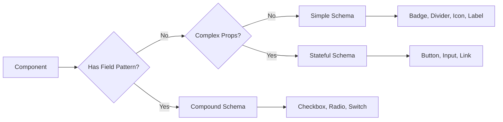

# Design Document: Code Connect All Components

## Overview

This design covers the systematic creation and audit of Figma Code Connect schemas for all UI Foundations components. Code Connect maps Figma component variants to production HTML/CSS snippets visible in Figma Dev Mode, enabling developers to copy correct markup directly from the design tool.

The scope includes:
- **New schemas**: Switch, Link (no schema files exist yet)
- **Audit existing schemas**: Button, ButtonGroup, Input, Checkbox, Radio, Badge, Icon, Label, Divider, Form (already have schema files, need consistency review)
- **Publishing**: Registering all schemas with the Figma team library

### Key Decisions

| Decision | Choice | Rationale |
|----------|--------|-----------|
| Code Connect variant | HTML (not React) | Matches the CSS-first, framework-agnostic design system |
| Import pattern | `import figma, { html } from "@figma/code-connect/html"` | Required by `@figma/code-connect` HTML mode |
| File convention | `schemas/web-<component>.figma.ts` + `schemas/web-<component>.ts` | Established pattern in existing schemas |
| Figma file | `uqMsy8fV1fPbQdAzgwlmBA` (UI Foundations) | Single source of truth for all components |

## Architecture

### Component Classification

Components fall into three structural categories based on their Figma structure and HTML output complexity:



| Category | Components | Characteristics |
|----------|-----------|-----------------|
| **Simple** | Badge, Divider, Icon, Label | Single `figma.connect()`, few props, no boolean states |
| **Stateful** | Button, ButtonGroup, Input, Link | Single `figma.connect()`, state/variant enums, disabled handling |
| **Compound** | Checkbox, Radio, Switch | Two `figma.connect()` calls (standalone + field wrapper), boolean states, ARIA attributes |

### Schema File Structure

Every schema follows this structure:

```
schemas/
├── web-<component>.figma.ts   ← Code Connect mapping (figma.connect calls)
└── web-<component>.ts         ← Props interface (TypeScript types)
```

## Components and Interfaces

### Props Interface Design

Each component's props interface lives in `web-<component>.ts` and types the destructured parameter of the `example` function.

#### Simple Components

```typescript
// web-badge.ts
export interface BadgeProps {
  className: string;
  text: string;
}

// web-divider.ts
export interface DividerProps {
  className: string;
}

// web-icon.ts
export interface IconProps {
  name: string;
}

// web-label.ts
export interface LabelProps {
  className: string;
  text: string;
}
```

#### Stateful Components

```typescript
// web-button.ts (needs audit — currently uses React types)
export interface ButtonProps {
  className: string;
  disabled: boolean;
  text: string;
  ariaLabel: string | undefined;
}

// web-input.ts
export interface InputProps {
  className: string;
  disabled: boolean;
  type: string;
  readonlyAttr: string;
  placeholder: string;
  value: string;
}

// web-link.ts (NEW)
export interface LinkProps {
  className: string;
  href: string;
  text: string;
  ariaDisabled: string | undefined;
  tabindex: string | undefined;
}

// web-button-group.ts (needs audit — currently uses React types)
export interface ButtonGroupProps {
  orientation: string;
  attached: string;
}
```

#### Compound Components (Standalone + Field)

```typescript
// web-switch.ts (NEW)
export interface SwitchProps {
  className: string;
  checked: string;
  disabled: boolean;
  ariaChecked: string;
  ariaLabel: string;
}

export interface SwitchFieldProps {
  wrapperClassName: string;
  className: string;
  checked: string;
  disabled: boolean;
  text: string;
}
```

### Schema Patterns Per Component

#### Switch (NEW — Compound)

**Standalone**: Maps Checked, State, Disabled variants to `.switch` classes. Outputs `<input type="checkbox" role="switch">` with `aria-checked` and `aria-label`.

**Field wrapper**: Maps Is Disabled variant to `.switch-field` wrapper. Outputs `<label class="switch-field">` containing the switch input and `<span class="switch-field__text">`.

Variant-to-class mapping:
| Figma Property | Value | CSS Class |
|---------------|-------|-----------|
| Checked | Unchecked | _(none)_ |
| Checked | Checked | `is-checked` |
| State | Default | _(none)_ |
| State | Hover | `is-hover` |
| State | Active | `is-active` |
| Disabled | True/true | `is-disabled` |
| Disabled | False/false | _(none)_ |

#### Link (NEW — Stateful)

**Single connect**: Maps State variant to `.link` classes. Outputs `<a>` element with conditional `aria-disabled` and `tabindex` for the disabled state.

Variant-to-class mapping:
| Figma Property | Value | CSS Class |
|---------------|-------|-----------|
| State | Default | _(none)_ |
| State | Hover | `is-hover` |
| State | Active | `is-active` |
| State | Visited | `is-visited` |
| State | Disabled | `is-disabled` |

**Note**: The Link component does not yet have a CSS pattern file (`src/ui/patterns/link.css`). The schema will use the class names that the CSS pattern will implement. The CSS pattern file creation is outside this spec's scope but should follow the same conventions.

#### Existing Schemas — Audit Findings

| Component | Status | Issues to Fix |
|-----------|--------|---------------|
| Button | ✅ Exists | Props interface uses React types instead of plain strings; `text` prop uses hardcoded "Book now" |
| ButtonGroup | ✅ Exists | Props interface uses React types; missing `className` in props |
| Input | ✅ Exists | Consistent with pattern |
| Checkbox | ✅ Exists | Reference implementation — no changes needed |
| Radio | ✅ Exists | Reference implementation — no changes needed |
| Badge | ✅ Exists | Consistent with pattern |
| Icon | ✅ Exists | Consistent with pattern |
| Label | ✅ Exists | Consistent with pattern |
| Divider | ✅ Exists | Consistent with pattern |
| Form | ✅ Exists | Composite component — consistent |

### HTML Output Templates

#### Switch Standalone
```html
<input
  type="checkbox"
  role="switch"
  class="switch is-checked"
  checked="true"
  disabled="false"
  aria-checked="true"
  aria-label="Switch"
/>
```

#### Switch Field
```html
<label class="switch-field">
  <input
    type="checkbox"
    role="switch"
    class="switch is-checked"
    checked="true"
    disabled="false"
  />
  <span class="switch-field__text">Label text</span>
</label>
```

#### Link
```html
<a class="link" href="#">
  Link text
</a>
```

#### Link (Disabled)
```html
<a class="link is-disabled" href="#" aria-disabled="true" tabindex="-1">
  Link text
</a>
```

## Data Models

### Figma Component Set Node IDs

Each `figma.connect()` call requires the correct Component Set node ID from the Figma file. These are discovered via the Figma API or Dev Mode inspection.

| Component | Type | Node ID |
|-----------|------|---------|
| Switch | Standalone | TBD — discover from Figma file |
| Switch | Field | TBD — discover from Figma file |
| Link | Standalone | TBD — discover from Figma file |
| Button | Standalone | `1-83` (existing) |
| ButtonGroup | Group | `2075-349` (existing) |
| Input | Standalone | `2035-317` (existing) |
| Checkbox | Standalone | `2142-524` (existing) |
| Checkbox | Field | `2281-730` (existing) |
| Radio | Standalone | `2329-241` (existing) |
| Radio | Field | `2329-250` (existing) |
| Badge | Standalone | `2385-709` (existing) |
| Icon | Standalone | `2016-293` (existing) |
| Label | Standalone | `2026-810` (existing) |
| Divider | Standalone | `2528-272` (existing) |
| Form | Field | `2070-474` (existing) |

### Node ID Discovery Strategy

1. **Use Figma MCP tools**: Call `get_metadata` on the UI Foundations file to list pages and find component sets
2. **Navigate component pages**: Drill into the page containing form controls to find Switch and Link component sets
3. **Verify with `get_design_context`**: Confirm the node is a Component Set (not an individual variant)
4. **URL format**: Always use hyphen format in the URL: `node-id=XXXX-YYY`

### Variant Property Discovery

For new components (Switch, Link), the Figma component's variant properties must be discovered:

1. Call `get_context_for_code_connect` with the component set node ID
2. Extract property definitions (names, types, variant options)
3. Map each property to the appropriate `figma.*` helper:
   - Enum properties → `figma.enum("PropertyName", { ... })`
   - Boolean properties → `figma.boolean("PropertyName")`
   - Text properties → `figma.string("PropertyName")`

## Correctness Properties

*A property is a characteristic or behavior that should hold true across all valid executions of a system — essentially, a formal statement about what the system should do. Properties serve as the bridge between human-readable specifications and machine-verifiable correctness guarantees.*

### Property 1: Schema Structural Consistency

*For any* schema file in `schemas/web-*.figma.ts`, the file SHALL begin with `import figma, { html } from "@figma/code-connect/html"` as its first import, and SHALL import a Props interface from the corresponding `./web-<component>` module.

**Validates: Requirements 3.1, 3.4, 9.3, 9.4**

### Property 2: CSS Class Mapping Correctness

*For any* `figma.className([...])` call in a schema file, the first element SHALL be the bare component name matching the CSS pattern file (e.g. `"button"`, `"checkbox"`, `"switch"`), default variant values SHALL map to `undefined`, and state variant values SHALL map to `is-*` prefixed class names.

**Validates: Requirements 1.1, 2.1, 6.1, 6.2, 6.3**

### Property 3: Boolean Enum Casing Consistency

*For any* `figma.enum()` call that maps a boolean-like property (Disabled, Checked, Is Disabled), the mapping object SHALL include both capitalized (`True`/`False`) and lowercase (`true`/`false`) keys producing identical values.

**Validates: Requirements 1.4, 3.2**

### Property 4: Props Interface Completeness

*For any* schema file, every prop name destructured in the `example` function SHALL have a corresponding typed field in the Props interface exported from the companion `web-<component>.ts` file, with `string` for className/enum-derived values, `boolean` for `figma.boolean()` values, and `string | undefined` for optional ARIA attributes.

**Validates: Requirements 4.1, 4.2, 4.3**

### Property 5: HTML Output Structure Correctness

*For any* component schema, the `example` function SHALL produce an HTML template whose root element matches the component's semantic element (`<input>` for Checkbox/Radio/Switch, `<a>` for Link, `<button>` for Button, `<span>` for Badge/Icon/Label, `<hr>` for Divider, `<div>` for ButtonGroup).

**Validates: Requirements 1.2, 2.2**

### Property 6: Accessibility Attribute Completeness

*For any* form control schema (Checkbox, Radio, Switch, Input), the HTML output SHALL include either an `aria-label` attribute or be wrapped in a `<label>` element. For decorative components (Icon), the output SHALL include `aria-hidden="true"`. For components overriding native semantics, the output SHALL include the correct `role` attribute.

**Validates: Requirements 3.3, 8.1, 8.3, 8.4**

### Property 7: Node ID URL Format Correctness

*For any* Figma URL string passed as the first argument to `figma.connect()`, the `node-id` query parameter SHALL use hyphen-separated digits format (matching the pattern `\d+-\d+`).

**Validates: Requirements 5.3**

### Property 8: File Location Correctness

*For any* component in the design system with a Code Connect schema, its schema file SHALL exist at `schemas/web-<component>.figma.ts` and its props interface SHALL exist at `schemas/web-<component>.ts`.

**Validates: Requirements 9.1, 9.2**

## Error Handling

| Scenario | Handling |
|----------|----------|
| Node ID not found in Figma file | `npx figma connect publish` reports the invalid node reference; fix by re-discovering the correct Component Set ID |
| Variant property name mismatch | Code Connect silently ignores unmapped properties; verify by inspecting Dev Mode output after publish |
| TypeScript compilation error | `tsc --noEmit` catches type mismatches between schema and props interface before publish |
| Figma file not accessible | Publish command fails with auth error; ensure `FIGMA_ACCESS_TOKEN` env var is set |
| Component not published to team library | Code Connect requires the component to be published; publish the library first |
| Duplicate `figma.connect()` for same node | Last registration wins; ensure each node ID appears exactly once per schema file |

## Testing Strategy

### Approach

This feature is primarily about **code generation correctness** — ensuring schema files produce the right HTML output for given Figma variant combinations. Property-based testing is applicable for validating structural invariants across all schema files.

### Property-Based Testing

**Library**: `fast-check` (TypeScript PBT library compatible with Node.js test runner)

**Configuration**: Minimum 100 iterations per property test

Each correctness property (1–8) maps to a property-based test that:
1. Generates random schema file selections or variant combinations
2. Parses the file structure (AST or regex-based)
3. Asserts the invariant holds

**Tag format**: `Feature: code-connect-all-components, Property {N}: {title}`

### Unit Tests (Example-Based)

- **Per-component snapshot tests**: For each schema file, verify the HTML output for key variant combinations (default state, hover, disabled, checked)
- **TypeScript compilation**: Run `tsc --noEmit` on all schema files to catch type errors
- **Import resolution**: Verify each `.figma.ts` file can resolve its `./web-<component>` import
- **Specific edge cases**: Checkbox `aria-checked="mixed"` for indeterminate, Link `aria-disabled="true"` when disabled, Icon `aria-hidden="true"`

### Integration Tests

- **Publish dry-run**: Run `npx figma connect publish --dry-run` to verify all schemas are valid without actually publishing
- **Node ID validation**: Query the Figma API to confirm each referenced node ID exists and is a Component Set

### Publishing Workflow

1. Create/update all schema files
2. Run `tsc --noEmit` to verify compilation
3. Run property tests to verify structural invariants
4. Run `npx figma connect publish --dry-run` to validate against Figma
5. Run `npx figma connect publish` to register with the team library
6. Verify in Figma Dev Mode that snippets appear correctly
