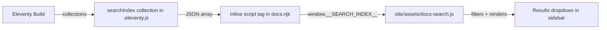

# Design Document: Docs Navbar Search

## Overview

This feature adds a client-side search capability to the docs site sidebar. It consists of three parts:

1. **Build-time index generation** — An Eleventy collection that collects all foundation and component doc pages into a JSON array, embedded inline in the page HTML.
2. **Client-side search module** — A vanilla JS module that filters the index on each keystroke and renders results into a dropdown below the search input.
3. **Sidebar UI** — A search input placed above the nav groups in `docs.njk`, with a results dropdown, keyboard navigation, and dismiss behavior.

The search is entirely client-side with no external dependencies. The index is small (roughly 20–30 entries) and embedded in the page, so there is no network cost beyond the initial page load.

### Key Design Decisions

- **Inline JSON over fetch**: The index is small enough to embed as a `<script>` tag with `type="application/json"`. This avoids an extra HTTP request and simplifies the implementation. A separate `.json` endpoint would be premature for this scale.
- **Substring matching over fuzzy search**: Given the small index size and the nature of the content (short titles and descriptions), simple case-insensitive substring matching provides good results without the complexity of fuzzy scoring algorithms.
- **Vanilla JS**: Consistent with the existing docs site — no frameworks, no build step for JS.
- **Docs-specific CSS only**: Per Rule 13, the search UI uses `--docs-*` custom properties, not component-level tokens.
- **Collection-based index**: Uses `eleventyConfig.addCollection("searchIndex", ...)` in `.eleventy.js` rather than a global data file, since collections are the natural way to access page data in Eleventy.

## Architecture



The architecture has three layers:

1. **Data layer** (`.eleventy.js` — new `searchIndex` collection) — Runs at build time. Receives the Eleventy collections API and produces an array of `{ title, description, url, type }` objects. This is a pure function: collections in, array out.

2. **Template layer** (`site/_includes/layouts/docs.njk`) — The layout template renders the search input HTML in the sidebar and embeds the search index as an inline JSON script tag. It also loads the search JS module.

3. **Behavior layer** (`site/assets/docs-search.js`) — A vanilla JS IIFE that reads the embedded index, attaches event listeners to the search input, performs filtering, renders results, and handles keyboard navigation and dismiss behavior.

## Components and Interfaces

### 1. Search Index Collection (in `.eleventy.js`)

A new Eleventy collection added via `addCollection` that combines foundation and component doc entries.

```js
// Added to .eleventy.js
eleventyConfig.addCollection("searchIndex", (collectionApi) => {
  const foundations = collectionApi
    .getFilteredByGlob("site/foundations/**/*.md")
    .filter((page) => page.data.title);
  const components = collectionApi
    .getFilteredByGlob("site/components/**/*.md")
    .filter((page) => !page.data.isPlayground && page.data.title);

  const entries = [];

  for (const page of foundations) {
    entries.push({
      title: page.data.title,
      description: page.data.description || "",
      url: page.url,
      type: "token",
    });
  }

  for (const page of components) {
    entries.push({
      title: page.data.title,
      description: page.data.description || "",
      url: page.url,
      type: "component",
    });
  }

  return entries;
});
```

**Filtering rules:**
- Include all pages from `site/foundations/**/*.md` with a title → type `"token"`
- Include all pages from `site/components/**/*.md` with a title, excluding playground pages → type `"component"`
- Playground pages are excluded by the `isPlayground` frontmatter check
- Example pages and Getting Started are excluded by glob scope (they live under `site/examples/` and `site/getting-started/`, not under foundations or components)

### 2. Search Input HTML (in `docs.njk`)

Placed inside `.docs-sidebar`, after `.docs-logo` and before `.docs-nav`:

```html
<div class="docs-search" role="combobox" aria-expanded="false" aria-haspopup="listbox" aria-owns="docs-search-results">
  <input
    type="search"
    class="docs-search-input"
    placeholder="Search tokens & components"
    aria-label="Search documentation"
    aria-autocomplete="list"
    aria-controls="docs-search-results"
    autocomplete="off"
  />
  <ul id="docs-search-results" class="docs-search-results" role="listbox" hidden>
  </ul>
</div>
```

The inline JSON index is embedded just before the search script:

```html
<script id="docs-search-index" type="application/json">
{{ collections.searchIndex | dump | safe }}
</script>
<script src="/assets/docs-search.js"></script>
```

### 3. Search Behavior Module (`site/assets/docs-search.js`)

A self-contained IIFE with no dependencies.

**Public interface:** None — the module is self-initializing.

**Internal functions:**

| Function | Signature | Purpose |
|---|---|---|
| `init` | `() → void` | Reads index from inline JSON, attaches listeners |
| `filterIndex` | `(query: string, index: SearchEntry[]) → SearchEntry[]` | Pure filter function — case-insensitive substring match on title and description |
| `renderResults` | `(results: SearchEntry[], container: HTMLUListElement) → void` | Clears container, creates `<li>` elements with links and type badges |
| `renderEmptyState` | `(query: string, container: HTMLUListElement) → void` | Renders a "No results for ..." message |
| `setActiveIndex` | `(index: number) → void` | Sets `aria-selected` on the active item, scrolls into view |
| `show` | `() → void` | Removes `hidden`, sets `aria-expanded="true"` |
| `hide` | `() → void` | Adds `hidden`, sets `aria-expanded="false"`, resets activeIndex |

**`filterIndex` logic (pure function, testable in isolation):**
```
filterIndex(query, index):
  normalized = query.trim().toLowerCase()
  if normalized is empty: return []
  return index.filter(entry =>
    entry.title.toLowerCase().includes(normalized) ||
    entry.description.toLowerCase().includes(normalized)
  )
```

**Event handling:**
- `input` event on search input → call `filterIndex`, render results or empty state, show/hide
- `keydown` on search input:
  - `ArrowDown` → move activeIndex forward (clamp at end)
  - `ArrowUp` → move activeIndex backward (clamp at 0)
  - `Enter` → navigate to active result's URL
  - `Escape` → hide results, return focus to input
- `click` on `document` → if target is outside `.docs-search`, hide results
- `focusin` on search input → if query is non-empty and results exist, show results

### 4. Search CSS (appended to `site/assets/docs.css`)

All styles use `--docs-*` custom properties. No component tokens (`--button-*`, `--input-*`, etc.).

Key styles:

```css
.docs-search { position: relative; margin: 0 0 16px; }

.docs-search-input {
  width: 100%;
  padding: 8px 12px;
  border: 1px solid var(--docs-border);
  border-radius: 10px;
  background: var(--docs-surface-1);
  color: var(--docs-text-0);
  font-family: var(--docs-font-sans);
  font-size: 0.88rem;
  outline: none;
}

.docs-search-input:focus {
  border-color: var(--docs-accent);
  box-shadow: 0 0 0 3px rgba(37, 99, 235, 0.15);
}

.docs-search-results {
  position: absolute;
  top: 100%;
  left: 0; right: 0;
  margin: 4px 0 0;
  padding: 4px;
  list-style: none;
  border: 1px solid var(--docs-border);
  border-radius: 12px;
  background: var(--docs-surface-1);
  box-shadow: var(--docs-shadow-md);
  z-index: 100;
  max-height: 320px;
  overflow-y: auto;
}

.docs-search-result[aria-selected="true"] a {
  background: var(--docs-surface-2);
}
```

At the mobile breakpoint (`max-width: 980px`), the search container remains full-width within the collapsed sidebar. The dropdown uses `position: absolute` relative to `.docs-search`, so it works in both layouts.

## Data Models

### SearchEntry

| Field | Type | Description |
|---|---|---|
| `title` | `string` | Page title from frontmatter |
| `description` | `string` | Page description from frontmatter (may be empty string) |
| `url` | `string` | Page URL path (e.g., `/components/button/`) |
| `type` | `"token" \| "component"` | Entry category for display |

The search index is an `Array<SearchEntry>` serialized as JSON in an inline `<script>` tag.

### Keyboard Navigation State (closure variables)

| Field | Type | Description |
|---|---|---|
| `activeIndex` | `number` | Currently focused result index, -1 when none |
| `currentResults` | `SearchEntry[]` | Current filtered results |
| `isOpen` | `boolean` | Whether the results list is visible |

## Correctness Properties

*A property is a characteristic or behavior that should hold true across all valid executions of a system — essentially, a formal statement about what the system should do. Properties serve as the bridge between human-readable specifications and machine-verifiable correctness guarantees.*

### Property 1: Index entry correctness

*For any* doc page in the foundations or components glob (excluding playground pages), the search index builder SHALL produce an entry containing the page's title, description, url, and the correct type label ("token" for foundations, "component" for components), and the total number of entries SHALL equal the number of qualifying input pages.

**Validates: Requirements 2.1, 2.2, 2.3**

### Property 2: Index exclusion

*For any* page that has `isPlayground: true`, or lives under `/examples/`, or is the Getting Started page, the search index builder SHALL NOT include that page in the output index.

**Validates: Requirements 2.4**

### Property 3: Filter correctness

*For any* search index and any query string, the `filterIndex` function SHALL return exactly the entries whose title or description contains the query as a case-insensitive substring, and no others.

**Validates: Requirements 3.1, 3.2**

### Property 4: Result rendering completeness

*For any* non-empty array of SearchEntry objects, the render function SHALL produce one result item per entry, where each item contains a link with the entry's URL as href, the entry's title as visible text, and a type indicator matching the entry's type field.

**Validates: Requirements 4.1, 4.2, 4.3**

### Property 5: Keyboard navigation bounds

*For any* results list of length N (N ≥ 1) and any sequence of ArrowDown and ArrowUp key presses, the active index SHALL remain within the range [0, N−1], clamping at boundaries.

**Validates: Requirements 6.2**

## Error Handling

| Scenario | Handling |
|---|---|
| Search index `<script>` tag missing or contains invalid JSON | `init` catches the parse error, logs a console warning, and disables search. The input remains visible but non-functional — no crash. |
| Empty search index (no docs pages built) | Search works normally — every query returns zero results and shows the empty state message. |
| Missing title or description in a page's frontmatter | Index builder defaults to empty string for description. Pages without a title are excluded from the index (filtered by `page.data.title` check). |
| Very long query string | No special handling needed — `String.includes()` handles arbitrary lengths. The `type="search"` input provides a native clear button in most browsers. |
| Results list overflow | CSS `max-height: 320px` with `overflow-y: auto` prevents the dropdown from exceeding the sidebar viewport. |

## Testing Strategy

### Unit Tests (example-based)

Unit tests cover specific scenarios and edge cases using the project's existing test setup.

| Test | What it verifies |
|---|---|
| Empty query returns empty array | Requirement 3.3 |
| Whitespace-only query returns empty array | Requirement 3.3 edge case |
| No-match query returns empty array | Requirement 5.1 |
| Escape key hides results and focuses input | Requirement 6.5 |
| Click outside hides results | Requirement 8.1 |
| Query text preserved after dismiss | Requirement 8.2 |

### Property-Based Tests

Property-based tests verify universal properties across many generated inputs. Use **fast-check** as the PBT library.

Each property test runs a minimum of **100 iterations** and is tagged with its design property reference.

| Property | Tag | Generators |
|---|---|---|
| Property 1: Index entry correctness | `Feature: docs-navbar-search, Property 1: Index entry correctness` | Random arrays of page-like objects with title, description, url, isPlayground, glob path |
| Property 2: Index exclusion | `Feature: docs-navbar-search, Property 2: Index exclusion` | Random page objects with isPlayground=true, example paths, getting-started paths mixed with valid pages |
| Property 3: Filter correctness | `Feature: docs-navbar-search, Property 3: Filter correctness` | Random SearchEntry arrays and random query strings (mixed case, substrings, unicode, empty) |
| Property 4: Result rendering completeness | `Feature: docs-navbar-search, Property 4: Result rendering completeness` | Random non-empty arrays of SearchEntry objects with varied titles, descriptions, urls, types |
| Property 5: Keyboard navigation bounds | `Feature: docs-navbar-search, Property 5: Keyboard navigation bounds` | Random list lengths (1–50) and random sequences of "ArrowUp"/"ArrowDown" strings |

### Integration / Smoke Tests

| Test | What it verifies |
|---|---|
| Eleventy build produces inline search index | Requirement 2.5 — verify built HTML contains `<script id="docs-search-index">` with valid JSON |
| Search CSS uses only `--docs-*` properties | Requirements 7.1, 7.2, 7.3 — grep the search CSS block for any `--button-*`, `--input-*`, etc. |
| Search input has accessible label | Requirement 1.4 — verify `aria-label` attribute exists |
| Mobile breakpoint renders search | Requirement 7.4 — visual check at 980px breakpoint |
