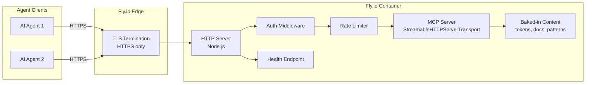

# Design Document: MCP Remote Deployment

## Overview

This design packages the existing `@ui-foundations/mcp-server` for remote hosting as a containerized HTTP endpoint. The server already supports Streamable HTTP transport (`--transport http --port 3100`) — this feature adds the operational layers required for production deployment: containerization with baked-in content, authentication middleware, rate limiting, health endpoints, graceful shutdown, structured logging, and a CI/CD pipeline for automated deployment.

The architecture keeps the core MCP server logic untouched. New capabilities are implemented as middleware wrapping the existing HTTP server, and deployment concerns are handled outside the application via Docker and GitHub Actions.

**Deployment target:** Fly.io — chosen for simplicity, cost-effectiveness (free tier for small apps, pay-per-use beyond), built-in TLS termination, automatic HTTPS redirect, global edge networking, and native Docker container support with `fly deploy`.

## Architecture



**Request flow:**

1. Agent connects via HTTPS to the Fly.io endpoint
2. Fly.io terminates TLS (minimum TLS 1.2, valid public certificate)
3. Request hits the Node.js HTTP server inside the container
4. `/health` requests bypass auth and return status directly
5. All other requests pass through auth middleware (Bearer token validation)
6. Authenticated requests pass through rate limiter (per-key tracking)
7. Valid requests reach the MCP StreamableHTTPServerTransport handler

**Key decisions:**
- TLS termination at the platform level (Fly.io) rather than in-app — simpler, auto-renewing certificates, no cert management code
- Content baked into the Docker image at build time — eliminates runtime git clones, secrets for repo access, or volume mounts
- Middleware layered on the existing `node:http` server — no Express/Fastify dependency added

## Components and Interfaces

### 1. Dockerfile (`packages/mcp-server/Dockerfile`)

Multi-stage build that produces a minimal production image:

```dockerfile
# Stage 1: Build
FROM node:22-alpine AS builder
WORKDIR /app
COPY package*.json ./
RUN npm ci
COPY src/ src/
COPY tsconfig.json ./
RUN npm run build

# Stage 2: Production
FROM node:22-alpine AS production
WORKDIR /app
ENV NODE_ENV=production
COPY package*.json ./
RUN npm ci --omit=dev
COPY --from=builder /app/dist/ dist/

# Bake in repository content needed at runtime
COPY content/ content/

EXPOSE 3100
ENV PORT=3100
CMD ["node", "dist/mcp/index.js", "--transport", "http", "--port", "3100", "--root", "/app/content"]
```

The `content/` directory is assembled during CI from the repository root, containing only the files the server indexes (tokens, docs, patterns, foundations, governance, components).

### 2. Auth Middleware (`packages/mcp-server/src/security/auth.ts`)

```typescript
export interface AuthConfig {
  /** Comma-separated API keys loaded from MCP_API_KEYS env var */
  apiKeys: string[];
}

export interface AuthResult {
  authenticated: boolean;
  keyIdentifier?: string; // last 4 chars for logging
  error?: string;
}

/**
 * Validates Bearer token from Authorization header.
 * Uses constant-time comparison to prevent timing attacks.
 */
export function authenticateRequest(
  authHeader: string | undefined,
  config: AuthConfig
): AuthResult;
```

- Loads keys from `MCP_API_KEYS` environment variable (comma-separated)
- Supports multiple simultaneous keys for rotation
- Uses `crypto.timingSafeEqual` for comparison
- Returns key identifier (last 4 chars) for logging without exposing full key

### 3. Rate Limiter (`packages/mcp-server/src/security/rate-limiter.ts`)

```typescript
export interface RateLimiterConfig {
  /** Max requests per window per key */
  maxRequests: number;
  /** Window duration in milliseconds */
  windowMs: number;
}

export interface RateLimitResult {
  allowed: boolean;
  remaining: number;
  retryAfterSeconds?: number;
}

/**
 * In-memory sliding window rate limiter.
 * Tracks request counts per API key identifier.
 */
export class RateLimiter {
  constructor(config: RateLimiterConfig);
  check(keyIdentifier: string): RateLimitResult;
  consume(keyIdentifier: string): RateLimitResult;
}
```

- Configured via `RATE_LIMIT_MAX` (default: 100) and `RATE_LIMIT_WINDOW_MS` (default: 60000) env vars
- In-memory sliding window — suitable for single-instance deployment
- Tracks per API key (using full key hash, not just last 4 chars)
- Returns `Retry-After` header value on 429

### 4. Health Endpoint (`/health`)

Replaces the MCP tool-based health check with a proper HTTP endpoint for load balancer probes:

```typescript
interface HealthResponse {
  status: 'ok' | 'starting';
  uptimeSeconds: number;
  requestCount: number;
  startedAt: string;
}
```

- `GET /health` — no auth required
- Returns 200 with `"status": "ok"` when search index is built
- Returns 503 with `"status": "starting"` during initialization
- Used by Fly.io health checks to determine readiness

### 5. Graceful Shutdown (`packages/mcp-server/src/util/shutdown.ts`)

```typescript
export interface ShutdownConfig {
  /** Maximum time to wait for in-flight requests (ms) */
  gracePeriodMs: number;
  /** HTTP server to stop accepting connections on */
  server: import('node:http').Server;
}

/**
 * Registers SIGTERM handler for graceful shutdown.
 * 1. Stops accepting new connections
 * 2. Waits up to gracePeriodMs for in-flight requests
 * 3. Force-closes remaining connections and exits 0
 */
export function registerShutdownHandler(config: ShutdownConfig): void;
```

- Listens for `SIGTERM` (container stop signal)
- Calls `server.close()` to stop accepting new connections
- Tracks in-flight requests with a counter
- After 30s grace period, destroys remaining sockets and exits with code 0

### 6. Request Logger (`packages/mcp-server/src/util/request-logger.ts`)

Extends the existing `logger.ts` module with HTTP-level request logging to stdout:

```typescript
export interface RequestLogEntry {
  timestamp: string;
  method: string;
  path: string;
  statusCode: number;
  durationMs: number;
  keyId: string; // last 4 chars of API key
}

export interface AuthFailureLogEntry {
  timestamp: string;
  event: 'auth_failure';
  sourceIp: string;
  reason: string;
}
```

- Logs to **stdout** (not stderr) for container log collection
- Never logs full API keys or request bodies
- Key identifier is last 4 characters only

### 7. HTTP Server Wrapper (modified `index.ts`)

The existing HTTP transport setup in `index.ts` is extended with middleware:

```typescript
const httpServer = createHttpServer(async (req, res) => {
  // 1. Health check (no auth)
  if (req.method === 'GET' && req.url === '/health') {
    return handleHealth(req, res);
  }

  // 2. Authentication
  const authResult = authenticateRequest(
    req.headers['authorization'],
    authConfig
  );
  if (!authResult.authenticated) {
    return sendAuthError(res, authResult.error);
  }

  // 3. Rate limiting
  const rateResult = rateLimiter.consume(authResult.keyIdentifier!);
  if (!rateResult.allowed) {
    return sendRateLimit(res, rateResult.retryAfterSeconds!);
  }

  // 4. MCP transport handler
  await transport.handleRequest(req, res);
});
```

### 8. CI/CD Pipeline (`.github/workflows/deploy.yml`)

```yaml
name: Deploy MCP Server

on:
  push:
    branches: [main]
    paths:
      - 'packages/mcp-server/**'
      - 'docs/**'
      - 'tokens/**'
      - 'AGENTS.md'
      - 'DESIGN.md'
      - 'IMPLEMENTATION.md'

jobs:
  deploy:
    runs-on: ubuntu-latest
    steps:
      - checkout
      - assemble content directory
      - build Docker image (tagged with SHA + latest)
      - run integration tests against built image
      - deploy to Fly.io (on test success)
      - abort and report on test failure
```

### 9. Fly.io Configuration (`packages/mcp-server/fly.toml`)

```toml
app = "ui-foundations-mcp"
primary_region = "fra"  # Frankfurt for EU proximity

[build]

[http_service]
  internal_port = 3100
  force_https = true
  auto_stop_machines = true
  auto_start_machines = true
  min_machines_running = 1

[[http_service.checks]]
  grace_period = "10s"
  interval = "30s"
  method = "GET"
  path = "/health"
  timeout = "5s"

[env]
  NODE_ENV = "production"
  RATE_LIMIT_MAX = "100"
  RATE_LIMIT_WINDOW_MS = "60000"
```

## Data Models

### Environment Variables

| Variable | Required | Default | Description |
|----------|----------|---------|-------------|
| `MCP_API_KEYS` | Yes | — | Comma-separated list of valid API keys |
| `PORT` | No | `3100` | HTTP listener port |
| `RATE_LIMIT_MAX` | No | `100` | Max requests per key per window |
| `RATE_LIMIT_WINDOW_MS` | No | `60000` | Rate limit window in milliseconds |
| `NODE_ENV` | No | `production` | Node environment |

### Content Directory Structure (baked into image)

```
/app/content/
├── AGENTS.md
├── DESIGN.md
├── IMPLEMENTATION.md
├── docs/
│   ├── ui-foundations-rules.md
│   ├── foundations/
│   │   └── foundation-*.md
│   └── patterns/
│       └── *.md
├── tokens/
│   └── dist/tokens/css/*.css
├── src/
│   └── ui/patterns/*.css
└── schemas/
    └── web-*.figma.ts
```

### Rate Limiter State (in-memory)

```typescript
interface RateLimitBucket {
  /** Timestamps of requests within the current window */
  requests: number[];
  /** Key identifier (SHA-256 hash of full key) */
  keyHash: string;
}

// Map<keyHash, RateLimitBucket>
```

### Docker Image Tags

| Tag | Description |
|-----|-------------|
| `ghcr.io/org/ui-foundations-mcp:latest` | Most recent successful deployment |
| `ghcr.io/org/ui-foundations-mcp:<sha>` | Specific commit version |


## Correctness Properties

*A property is a characteristic or behavior that should hold true across all valid executions of a system — essentially, a formal statement about what the system should do. Properties serve as the bridge between human-readable specifications and machine-verifiable correctness guarantees.*

### Property 1: Authentication rejects invalid credentials with structured error

*For any* request where the Authorization header is missing, malformed, or contains a key not in the configured set, the auth middleware SHALL return HTTP 401 with a JSON body containing an `error` field with a descriptive message, and the request SHALL NOT reach the MCP transport handler.

**Validates: Requirements 3.1, 3.6**

### Property 2: Authentication accepts any configured key

*For any* set of N configured API keys (where N >= 1) and any key K selected from that set, a request bearing `Authorization: Bearer K` SHALL pass the auth middleware and reach the next handler.

**Validates: Requirements 3.3, 3.4**

### Property 3: Rate limiter enforces configured ceiling then rejects with Retry-After

*For any* rate limit configuration (maxRequests M, window W) and any single API key, the rate limiter SHALL allow exactly M requests within window W, and the (M+1)th request SHALL be rejected with a `RateLimitResult` where `allowed` is false and `retryAfterSeconds` is a positive number representing remaining window time.

**Validates: Requirements 7.1, 7.2**

### Property 4: Rate limit tracking is per-key independent

*For any* two distinct API keys A and B, requests consumed against key A SHALL NOT affect the remaining allowance of key B. Specifically, after A exhausts its limit, B SHALL still have its full allowance available.

**Validates: Requirements 7.4**

### Property 5: Shutdown rejects new connections after SIGTERM

*For any* connection attempt received after the shutdown handler has been triggered by SIGTERM, the server SHALL refuse the connection (socket destroyed or connection reset).

**Validates: Requirements 8.1**

### Property 6: Shutdown allows in-flight requests to complete within grace period

*For any* set of in-flight requests that complete within the 30-second grace period after SIGTERM, all such requests SHALL receive their full response before the server exits.

**Validates: Requirements 8.2**

### Property 7: Request log entries contain all required fields

*For any* completed HTTP request that passes authentication, the emitted stdout JSON log line SHALL contain all of: `timestamp` (ISO 8601), `method` (string), `path` (string), `statusCode` (integer), `durationMs` (non-negative number), and `keyId` (string of exactly 4 characters).

**Validates: Requirements 9.1**

### Property 8: Auth failure log entries contain all required fields

*For any* authentication failure event, the emitted stdout JSON log line SHALL contain all of: `timestamp` (ISO 8601), `event` (equal to "auth_failure"), `sourceIp` (string), and `reason` (non-empty string).

**Validates: Requirements 9.2**

### Property 9: Full API keys never appear in log output

*For any* request processed by the server (whether authenticated or rejected), no log line emitted to stdout or stderr SHALL contain the full text of any configured API key. Only the last 4 characters may appear.

**Validates: Requirements 9.3**

### Property 10: Health endpoint returns valid response shape

*For any* server state (initializing or ready), the `GET /health` endpoint SHALL return a JSON body containing `status` (string: "ok" or "starting"), `uptimeSeconds` (non-negative integer), `requestCount` (non-negative integer), and `startedAt` (ISO 8601 timestamp).

**Validates: Requirements 4.1**

## Error Handling

### Authentication Errors

| Scenario | Status | Response Body |
|----------|--------|---------------|
| Missing Authorization header | 401 | `{"error": "Authorization header required"}` |
| Malformed header (not Bearer format) | 401 | `{"error": "Invalid authorization format. Expected: Bearer <key>"}` |
| Invalid/expired key | 401 | `{"error": "Invalid API key"}` |

All 401 responses include `Content-Type: application/json` and `WWW-Authenticate: Bearer` headers.

### Rate Limiting Errors

| Scenario | Status | Response Body | Headers |
|----------|--------|---------------|---------|
| Rate limit exceeded | 429 | `{"error": "Rate limit exceeded", "retryAfter": <seconds>}` | `Retry-After: <seconds>` |

### Server Errors

| Scenario | Status | Response Body |
|----------|--------|---------------|
| Unhandled exception in MCP handler | 500 | `{"error": "Internal server error"}` |
| Server shutting down (new request) | 503 | `{"error": "Server shutting down"}` |

### Error Logging

- All 4xx and 5xx responses are logged with the error category
- Auth failures include source IP for abuse detection
- 500 errors log the full stack trace to stderr (not stdout, not to the client)
- Rate limit events are logged at info level (not error) since they are expected

### Graceful Degradation

- If the search index fails to build, server starts in degraded mode — health returns 200 but the `search` tool returns an error. This matches existing behavior.
- If `MCP_API_KEYS` is empty or missing at startup, the server refuses to start and exits with code 1 and a clear error message.

## Testing Strategy

### Unit Tests

Unit tests cover individual middleware modules in isolation:

- **Auth middleware**: Valid/invalid/missing/malformed headers, multiple key configs, constant-time comparison verification
- **Rate limiter**: Window enforcement, per-key independence, configuration loading, edge cases (boundary of window, exactly at limit)
- **Health endpoint**: Response shape in both ready and starting states
- **Shutdown handler**: Signal handling, grace period timing, force close behavior
- **Request logger**: Output format, field presence, key masking

Test runner: Node.js built-in test runner with `tsx` (existing project convention).

### Property-Based Tests

Property-based testing library: **fast-check** (already a devDependency in the project).

Each property test runs a minimum of 100 iterations and is tagged with its design property reference.

| Property | Test File | Strategy |
|----------|-----------|----------|
| Property 1 (auth rejects) | `tests/properties/auth.property.test.ts` | Generate random strings as invalid keys, verify 401 + JSON error shape |
| Property 2 (auth accepts) | `tests/properties/auth.property.test.ts` | Generate random key sets, pick any key, verify it passes |
| Property 3 (rate limit ceiling) | `tests/properties/rate-limiter.property.test.ts` | Generate random (max, window) configs, send max+1 requests, verify allow/reject boundary |
| Property 4 (rate limit isolation) | `tests/properties/rate-limiter.property.test.ts` | Generate two keys with random request sequences, verify independence |
| Property 7 (request log fields) | `tests/properties/request-logger.property.test.ts` | Generate random request data, verify log output contains all fields |
| Property 8 (auth failure log) | `tests/properties/request-logger.property.test.ts` | Generate random failure events, verify log fields |
| Property 9 (key secrecy) | `tests/properties/request-logger.property.test.ts` | Generate random API keys and requests, verify full key never in output |
| Property 10 (health shape) | `tests/properties/health.property.test.ts` | Generate random server states, verify response shape |

Properties 5 and 6 (shutdown behavior) are better suited to integration tests with timing control rather than property-based tests due to their reliance on signals and timeouts.

### Integration Tests

Run against the built Docker image in CI:

- Container starts and /health returns 200
- Auth rejects unauthenticated requests
- Auth accepts valid Bearer token
- Rate limiting kicks in after configured threshold
- MCP session can be established and tools/resources respond
- Graceful shutdown completes in-flight requests
- HTTPS redirect works on deployed endpoint (post-deploy smoke test)

### Test Configuration

```json
{
  "test:property": "node --import tsx --test tests/properties/**/*.property.test.ts",
  "test:integration:docker": "node --import tsx --test tests/integration/docker/**/*.test.ts"
}
```

Property test tag format: `// Feature: mcp-remote-deployment, Property N: <property text>`
