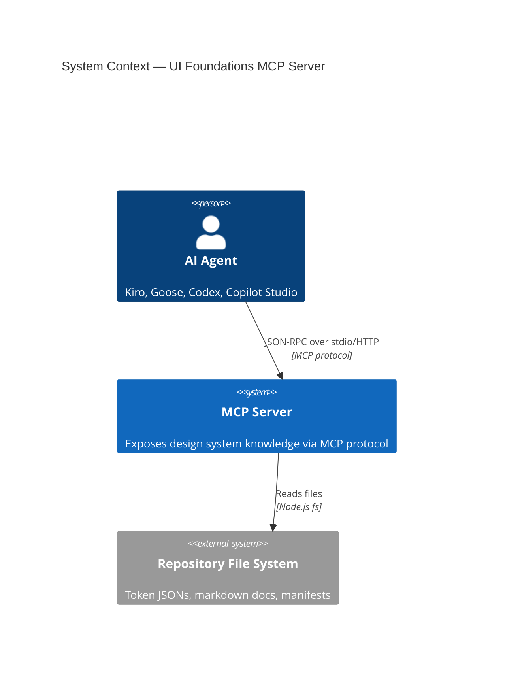
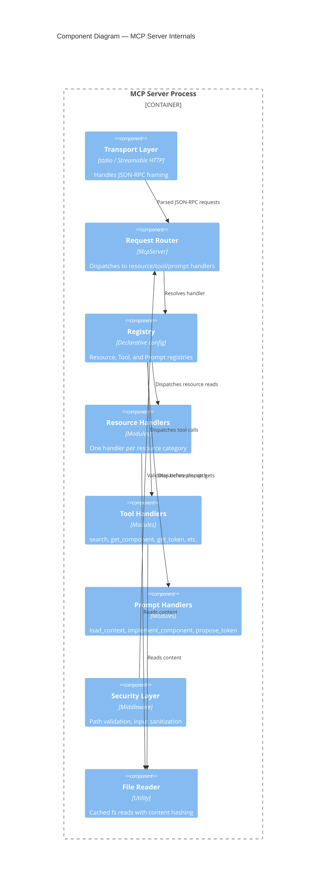
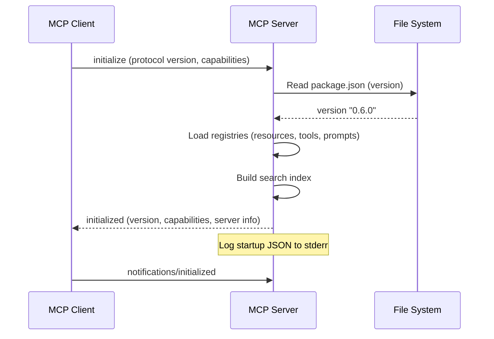
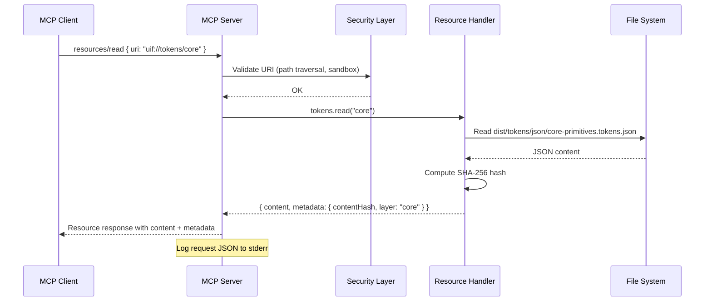
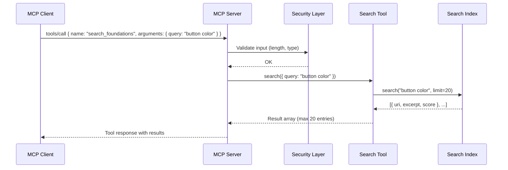
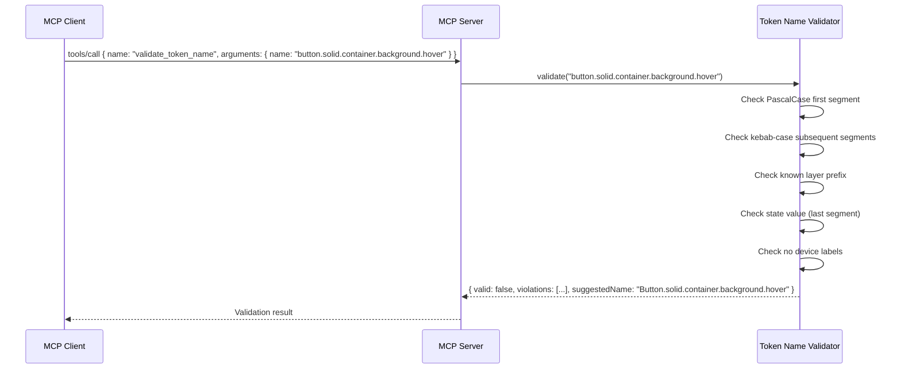

# Design Document: MCP Server

## Overview

The UI Foundations MCP Server is a Node.js process that exposes the design system's knowledge graph — tokens, components, patterns, governance rules, and architecture decisions — to AI agents via the [Model Context Protocol](https://modelcontextprotocol.io/). It acts as a structured, read-only interface between MCP-compatible clients and the repository's file system content.

### Design Goals

1. **Zero external dependencies** — file-system-only reads against the repository root
2. **Registry-driven extensibility** — new resources and tools added declaratively, no core changes
3. **Deterministic responses** — same input always produces the same output (content-hash based caching)
4. **Fast startup** — stdio handshake completes in under 2 seconds
5. **Security-first** — path traversal protection, input validation, no secret exposure

### Technology Choices

| Concern | Choice | Rationale |
|---------|--------|-----------|
| Runtime | Node.js ≥ 18 | Existing project runtime, native ESM, built-in test runner |
| MCP SDK | `@modelcontextprotocol/sdk` | Official TypeScript SDK, supports stdio + Streamable HTTP transports |
| Schema validation | `zod` | Required peer dependency of the MCP SDK, used for tool input validation |
| Language | TypeScript (strict) | Type safety for registries and handlers, compiled to ESM JS for distribution |
| Build | `tsc` | No bundler needed — straightforward compile to `dist/mcp/` |
| Test | Node.js built-in test runner + `fast-check` | Matches project conventions; fast-check for property-based testing |

---

## Architecture

### System Context Diagram



### Component Diagram



### Package Structure

```
packages/mcp-server/
├── package.json              # bin entry, engines, dependencies
├── tsconfig.json             # TypeScript config (strict, ESM)
├── src/
│   ├── index.ts              # Entry point: parse CLI args, create server, connect transport
│   ├── server.ts             # McpServer creation, capability registration
│   ├── registry/
│   │   ├── index.ts          # Registry loader
│   │   ├── resources.ts      # Resource registry definitions
│   │   ├── tools.ts          # Tool registry definitions
│   │   └── prompts.ts        # Prompt registry definitions
│   ├── resources/
│   │   ├── manifest.ts       # uif://manifest/* handlers
│   │   ├── agents.ts         # uif://agents/* handlers
│   │   ├── tokens.ts         # uif://tokens/* handlers
│   │   ├── components.ts     # uif://components/* handlers
│   │   ├── patterns.ts       # uif://patterns/* handlers
│   │   ├── governance.ts     # uif://governance/* handlers
│   │   └── foundations.ts    # uif://foundations/* handlers
│   ├── tools/
│   │   ├── search.ts         # search_foundations implementation
│   │   ├── get-component.ts  # get_component implementation
│   │   ├── get-token.ts      # get_token implementation
│   │   ├── get-pattern.ts    # get_pattern implementation
│   │   ├── get-rule.ts       # get_rule implementation
│   │   └── validate-token-name.ts  # validate_token_name implementation
│   ├── prompts/
│   │   ├── load-context.ts   # load_context prompt template
│   │   ├── implement-component.ts  # implement_component prompt template
│   │   └── propose-token.ts  # propose_token prompt template
│   ├── security/
│   │   ├── path-validator.ts # Path traversal detection & sandboxing
│   │   └── input-validator.ts # Input length & type validation
│   ├── util/
│   │   ├── file-reader.ts    # Cached file reader with SHA-256 hashing
│   │   ├── content-hash.ts   # SHA-256 hex digest utility
│   │   ├── logger.ts         # Structured JSON logging to stderr
│   │   ├── search-index.ts   # In-memory full-text search index
│   │   └── levenshtein.ts    # Edit distance for fuzzy matching
│   └── types.ts              # Shared TypeScript interfaces
└── tests/
    ├── resources/             # Resource handler tests
    ├── tools/                 # Tool handler tests
    ├── prompts/               # Prompt handler tests
    ├── security/              # Security validation tests
    └── properties/            # Property-based tests
```

---

## Components and Interfaces

### Transport Layer

The server supports two transports selected at startup via CLI flag:

| Transport | Flag | Use Case |
|-----------|------|----------|
| stdio | `--transport stdio` (default) | Local agent integration, `npx` usage |
| Streamable HTTP | `--transport http --port 3100` | Remote/shared access (Phase 2) |

```typescript
// Entry point pseudocode
const transport = args.transport === 'http'
  ? new StreamableHTTPServerTransport({ port: args.port })
  : new StdioServerTransport();

await server.connect(transport);
```

### Registry Pattern

Each registry is an array of declarative entries loaded at startup. The core server iterates entries and calls the SDK registration APIs.

```typescript
// Resource registry entry
interface ResourceRegistryEntry {
  uri: string;
  name: string;
  description: string;
  mimeType: string;
  category: ResourceCategory;
  handler: (uri: string, rootPath: string) => Promise<ResourceResponse>;
}

// Tool registry entry
interface ToolRegistryEntry {
  name: string;
  description: string;
  inputSchema: ZodSchema;
  handler: (args: unknown, rootPath: string) => Promise<ToolResponse>;
}

// Prompt registry entry
interface PromptRegistryEntry {
  name: string;
  description: string;
  arguments: PromptArgument[];
  handler: (args: Record<string, string>, rootPath: string) => Promise<PromptResponse>;
}
```

### File Reader (Cached)

A central utility that reads files relative to the configured root, caches content in memory, and produces SHA-256 content hashes for cache control.

```typescript
interface FileReadResult {
  content: string;
  contentHash: string;       // SHA-256 hex
  mimeType: string;
  lastRead: number;          // timestamp
}

class FileReader {
  private cache: Map<string, FileReadResult>;
  private rootPath: string;

  async read(relativePath: string): Promise<FileReadResult>;
  invalidate(relativePath: string): void;
  invalidateAll(): void;
}
```

On each `read()`, the file is re-read from disk (ensuring fresh content per Requirement 21.3) and the hash is recomputed. The cache stores the result to avoid redundant hashing within the same request cycle.

### Security Layer

All incoming requests pass through validation before reaching handlers:

1. **Path validation** — rejects `../`, `%2e%2e`, `..\`, double-encoded variants
2. **Sandbox enforcement** — resolved paths must be under `rootPath`
3. **Sensitive file blocking** — rejects `.env`, `.git/`, `*.pem`, `*.key`, `*.p12`, `*.pfx`, PEM headers
4. **Input length limits** — 1,000 chars default, 10,000 chars max for tool inputs, 200 chars for token names

### Structured Logger

All logging goes to `stderr` as JSON lines (one object per line):

```typescript
interface LogEntry {
  timestamp: string;     // ISO 8601
  method: string;        // JSON-RPC method
  target: string;        // URI or tool name
  responseMs: number;    // elapsed time
  success: boolean;
  requestId?: string | number;
  error?: { code: number; category: string };
}
```

### Search Index

An in-memory inverted index built at startup from all resource content. Supports substring matching and TF-IDF relevance scoring.

```typescript
interface SearchResult {
  uri: string;
  excerpt: string;       // up to 200 chars
  score: number;         // 0.0 – 1.0
}

class SearchIndex {
  constructor(rootPath: string);
  async build(): Promise<void>;
  search(query: string, limit?: number): SearchResult[];
}
```

---

## Data Models

### Resource Response

```typescript
interface ResourceResponse {
  uri: string;
  name: string;
  mimeType: string;
  content: string | object;
  metadata: {
    contentHash: string;
    category: ResourceCategory;
    layer?: TokenLayer;       // for token resources
  };
}

type ResourceCategory =
  | 'manifest'
  | 'agents'
  | 'tokens'
  | 'components'
  | 'patterns'
  | 'governance'
  | 'foundations';

type TokenLayer = 'core' | 'semantic' | 'component' | 'mode' | 'brand';
```

### Component Model

```typescript
interface ComponentData {
  name: string;                    // kebab-case canonical name
  description: string;
  documentation: string;           // full markdown content
  cssClassName: string;            // bare class name (e.g., "button")
  htmlPattern: string;             // example HTML
  variants: string[];              // ["solid", "outline", "ghost"]
  states: string[];                // ["default", "hover", "active", "focus", "disabled"]
  tokens: string[];                // associated token names
  codeConnectSchemaPath: string | null;  // path to .figma.ts file
  uri: string;                     // uif://components/{name}
}
```

### Token Model

```typescript
interface TokenData {
  name: string;                    // dot-notation (e.g., "Size.Spacing.100")
  cssProperty: string;             // CSS custom property (e.g., "--size-spacing-100")
  value: unknown;                  // resolved value from DTCG $value
  type: string;                    // DTCG $type (e.g., "dimension", "color")
  layer: TokenLayer;
}
```

### Pattern Model

```typescript
interface PatternData {
  name: string;                    // kebab-case identifier
  description: string;
  documentation: string;           // full markdown content
  relatedComponents: string[];     // component names used in this pattern
  relatedTokens: string[];         // referenced token names
  uri: string;                     // uif://patterns/{name}
}
```

### Token Validation Result

```typescript
interface TokenValidationResult {
  valid: boolean;
  violations: TokenViolation[];
  suggestedName: string | null;    // corrected name if invalid
}

interface TokenViolation {
  segment: string;                 // the failing segment
  ruleNumber: string;              // reference to foundation-002
  message: string;                 // human-readable explanation
}
```

### Error Response

All errors follow JSON-RPC 2.0 with MCP-defined codes:

| Code | Meaning | Usage |
|------|---------|-------|
| -32600 | Invalid request | Malformed JSON-RPC |
| -32601 | Method not found | Unknown method |
| -32602 | Invalid params | Missing/invalid parameters |
| -32002 | Resource not found | URI doesn't match any resource |
| -32603 | Internal error | File read failure, unexpected error |

---

## Sequence Diagrams

### Server Initialization (stdio)



### Resource Read



### Tool Call (search_foundations)



### Token Name Validation



---


## Correctness Properties

*A property is a characteristic or behavior that should hold true across all valid executions of a system — essentially, a formal statement about what the system should do. Properties serve as the bridge between human-readable specifications and machine-verifiable correctness guarantees.*

### Property 1: Capabilities list all registered entries

*For any* set of resources, tools, and prompts registered in the server's registries, the initialization capabilities response SHALL include every registered resource URI, tool name, and prompt name.

**Validates: Requirements 1.3**

### Property 2: Resource list entries contain all required fields

*For any* registered resource, the `resources/list` response entry SHALL contain a non-empty URI matching `uif://{category}/{path}`, a non-empty name, a non-empty description, a valid MIME type, and a category from the allowed set.

**Validates: Requirements 2.1, 2.2**

### Property 3: Pagination completeness

*For any* registry containing N resources, iterating through all pages (starting without a cursor, then following next cursors) SHALL yield exactly N total resource entries, with no individual page containing more than 50 entries.

**Validates: Requirements 2.4**

### Property 4: Invalid cursor rejection

*For any* string that is not a valid cursor issued by the server, a `resources/list` request with that cursor SHALL return a JSON-RPC error with code -32602.

**Validates: Requirements 2.5**

### Property 5: Not-found error includes valid alternatives

*For any* resource URI matching the `uif://{category}/{identifier}` pattern where the identifier does not correspond to a registered entry in that category, the error response SHALL include the requested URI and a list of valid identifiers for that category.

**Validates: Requirements 4.5, 6.3, 7.4, 9.3**

### Property 6: Case-insensitive identifier resolution

*For any* valid component name, pattern name, or rule category, and *for any* case variation of that identifier, the server SHALL resolve it to the canonical form and return the same response as the canonical identifier.

**Validates: Requirements 6.4, 11.5, 13.2, 14.3**

### Property 7: Component response completeness

*For any* valid component name, the `get_component` tool response SHALL contain all required fields: documentation (string), cssClassName (string), htmlPattern (string), variants (array), states (array), tokens (array), and codeConnectSchemaPath (string or null). Fields with no data SHALL be empty arrays or null, never omitted.

**Validates: Requirements 11.1, 11.4**

### Property 8: Fuzzy match suggestion for near-misses

*For any* string with Levenshtein distance ≤ 3 from a valid component name, the `get_component` error response SHALL include that valid name as a suggestion.

**Validates: Requirements 11.3**

### Property 9: Search result constraints

*For any* query string of 2 or more characters, the `search_foundations` tool SHALL return at most 20 results, each containing a URI (non-empty string), an excerpt of at most 200 characters, and a relevance score in the range [0.0, 1.0], ordered by descending score.

**Validates: Requirements 10.1, 10.2**

### Property 10: Short query rejection

*For any* string of fewer than 2 characters (including empty string), the `search_foundations` tool and the `get_token` tool (when no layer filter is provided) SHALL return a JSON-RPC error indicating the minimum query length.

**Validates: Requirements 10.3, 12.4**

### Property 11: Token search filter invariant

*For any* valid layer value and any query of 2+ characters, all tokens returned by `get_token` SHALL have a `layer` field matching the requested layer, a `name` field containing the query as a case-insensitive substring, and the result count SHALL not exceed 50.

**Validates: Requirements 12.1, 12.2**

### Property 12: Invalid enum parameter rejection

*For any* tool parameter constrained to an enumerated set (layer in get_token, category in get_rule, task_type in load_context, layer in propose_token), any value not in the valid set SHALL produce an error response listing all valid values for that parameter.

**Validates: Requirements 12.5, 14.2, 16.2, 16.3, 18.3**

### Property 13: Token name validation structural invariant

*For any* token name string, the `validate_token_name` response SHALL contain a boolean `valid` field. When `valid` is false, the response SHALL contain a non-empty `violations` array where each entry includes a `ruleNumber` and `message`, and a non-null `suggestedName`. When `valid` is true, `violations` SHALL be an empty array.

**Validates: Requirements 15.1, 15.2, 15.3**

### Property 14: Token naming rule enforcement

*For any* token name string where the first segment is PascalCase, subsequent segments are lowercase/kebab-case, the layer prefix matches a known layer, the last segment (if a state) is in the recognized state set, no segment contains device labels, and there are at least 2 dot-separated segments within the 200-character limit, the `validate_token_name` tool SHALL return `valid: true`. For any name violating one or more of these rules, it SHALL return `valid: false` with at least one violation citing the violated rule.

**Validates: Requirements 15.4, 15.5, 15.6**

### Property 15: Implement component prompt surface coverage

*For any* valid component name (non-empty, lowercase letters and hyphens only), the `implement_component` prompt template SHALL reference all 10 integration surfaces and include file paths containing the component name as a path segment.

**Validates: Requirements 17.1, 17.3, 17.4**

### Property 16: Propose token prompt layer tailoring

*For any* valid layer value (core, semantic, component, mode), the `propose_token` prompt template SHALL contain naming pattern guidance specific to that layer (variant-first for component, role-based for semantic, primitives for core, color palette for mode).

**Validates: Requirements 18.4**

### Property 17: Path traversal rejection

*For any* URI containing path traversal sequences (`../`, `%2e%2e%2f`, `..\`, `%2e%2e%5c`, or double-encoded variants), the server SHALL reject the request with an error and SHALL NOT resolve the path against the file system.

**Validates: Requirements 20.2**

### Property 18: Sandbox enforcement

*For any* file path that resolves to a location outside the configured root directory, the server SHALL deny access. For any request targeting `.env`, `.git/*`, `*.pem`, `*.key`, `*.p12`, or `*.pfx` files, the server SHALL deny access.

**Validates: Requirements 20.3, 20.4**

### Property 19: Input length enforcement

*For any* string parameter exceeding 1,000 characters, the server SHALL reject the request. For any tool input exceeding 10,000 characters, the server SHALL reject the request. Error responses for security rejections SHALL NOT contain internal file paths, stack traces, or environment variable values.

**Validates: Requirements 20.1, 20.5, 20.6**

### Property 20: Content hash consistency

*For any* resource read, the `contentHash` metadata value SHALL equal the SHA-256 hex digest of the returned content body. For two reads of the same resource with identical underlying file content, the hash SHALL be identical. For reads where the file content has changed, the hash SHALL differ.

**Validates: Requirements 21.2**

### Property 21: Error logging completeness

*For any* request that produces a JSON-RPC error response, the server SHALL write a JSON log entry to stderr containing an ISO 8601 timestamp, the request ID, the error code, the resource URI or tool name, response time in milliseconds, and an error category string.

**Validates: Requirements 19.4, 22.4**

### Property 22: Registry extensibility

*For any* new valid resource or tool entry added to the declarative registry, after server restart it SHALL appear in the corresponding list response alongside all previously registered entries. For any malformed entry, the server SHALL skip it, log an error, and continue loading all remaining valid entries.

**Validates: Requirements 24.3, 24.4, 24.5**

---

## Error Handling

### Error Strategy

All errors are returned as JSON-RPC 2.0 error objects. The server never throws unhandled exceptions to the transport layer.

```typescript
// Error construction utility
function mcpError(code: number, message: string, requestId: string | number): JsonRpcError {
  return {
    jsonrpc: '2.0',
    id: requestId,
    error: { code, message }
  };
}
```

### Error Categories

| Category | Code | Trigger | Recovery |
|----------|------|---------|----------|
| `invalid_request` | -32600 | Malformed JSON-RPC envelope | Client fixes request format |
| `method_not_found` | -32601 | Unknown method name | Client checks available methods |
| `invalid_params` | -32602 | Missing/invalid parameters, invalid cursor | Client fixes parameters |
| `resource_not_found` | -32002 | URI doesn't match registry | Client uses resources/list |
| `internal_error` | -32603 | File read failure, unexpected error | Retry or check server health |
| `security_violation` | -32600 | Path traversal, sensitive file access | Client fixes input |

### Error Response Rules

1. **Preserve request ID** — every error includes the original request `id`
2. **No internal leaks** — errors never expose absolute paths, stack traces, or env values
3. **Actionable messages** — errors include what went wrong and what valid alternatives exist
4. **Timing guarantee** — all error responses delivered within 2 seconds
5. **Logging** — every error is logged to stderr with full context (timestamp, requestId, code, target)

### Graceful Degradation

- If a registry entry references a missing file, the entry is skipped (logged) but all other entries load normally
- If a single resource file becomes unavailable after startup, only that resource returns an error; all others continue working
- The search index degrades gracefully — if indexing fails for one resource, others remain searchable

---

## Testing Strategy

### Unit Tests (Node.js built-in test runner)

Unit tests cover specific examples, edge cases, and integration points:

- **Resource handlers**: each handler returns correct content for known files
- **Tool handlers**: correct results for known inputs, proper error for invalid inputs
- **Prompt handlers**: correct template structure for each prompt
- **Security layer**: known path traversal patterns rejected, known safe paths allowed
- **File reader**: caching behavior, hash computation, missing file error
- **Search index**: known queries return expected results, empty index behavior
- **Logger**: log entries are valid JSON with required fields
- **CLI argument parsing**: `--root`, `--transport`, `--port` parsing

### Property-Based Tests (fast-check)

Property tests verify universal properties across randomized inputs. Each property test runs a minimum of 100 iterations.

**Library**: `fast-check` (npm package, well-established for JS/TS property testing)

**Property test configuration**:
- Minimum 100 iterations per property
- Each test tagged with: `Feature: mcp-server, Property {N}: {title}`
- Tests located in `packages/mcp-server/tests/properties/`

**Test files**:
- `registry.property.test.ts` — Properties 1, 2, 3, 4, 22
- `resolution.property.test.ts` — Properties 5, 6, 7, 8
- `search.property.test.ts` — Properties 9, 10, 11
- `validation.property.test.ts` — Properties 12, 13, 14
- `prompts.property.test.ts` — Properties 15, 16
- `security.property.test.ts` — Properties 17, 18, 19
- `caching.property.test.ts` — Property 20
- `logging.property.test.ts` — Property 21

### Integration Tests

Integration tests verify end-to-end behavior through the MCP protocol:

- Server initialization and handshake (stdio transport)
- Full request/response cycle for each resource category
- Search across indexed content
- Health check endpoint
- Connection timeout behavior
- File change detection (content hash updates)

### Test Runner Configuration

```json
{
  "scripts": {
    "test:unit": "node --test packages/mcp-server/tests/**/*.test.ts",
    "test:property": "node --test packages/mcp-server/tests/properties/**/*.property.test.ts",
    "test:integration": "node --test packages/mcp-server/tests/integration/**/*.test.ts",
    "test:mcp": "npm run test:unit && npm run test:property && npm run test:integration"
  }
}
```

### Coverage Goals

- Unit tests: all resource handlers, tool handlers, prompt handlers, utility functions
- Property tests: all 22 correctness properties
- Integration tests: startup, handshake, one representative flow per category
- No snapshot tests (content changes frequently with design system updates)
