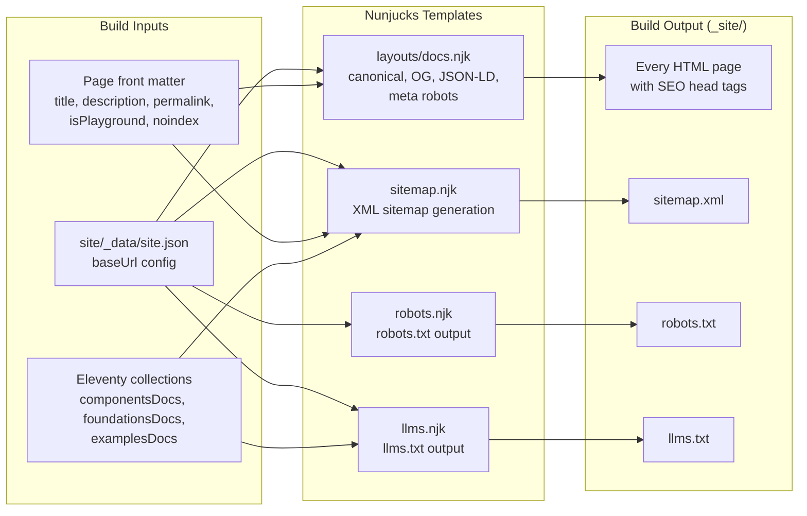

# Design Document: SEO Indexing

## Overview

This design adds comprehensive search engine and AI agent discoverability to the UI Foundations Eleventy documentation site. The implementation uses pure Nunjucks templates and Eleventy's built-in collection/data system — no external plugins.

All SEO features derive absolute URLs from a single `site.json` global data file. The approach modifies only:
- The base layout (`site/_includes/layouts/docs.njk`) for `<head>` metadata
- New Nunjucks template files for `sitemap.xml`, `robots.txt`, and `llms.txt`
- A new global data file `site/_data/site.json` for the base URL

## Architecture



### Design Decisions

1. **No plugins**: All templates are pure Nunjucks using Eleventy's built-in `collections.all`, collection filters, and global data. This keeps the build simple and avoids version-lock to third-party sitemap plugins.

2. **Single source of truth for URLs**: `site/_data/site.json` provides `baseUrl`. Every template reads from this one file. If it's empty, absolute-URL features gracefully degrade.

3. **Template-based generation**: `sitemap.xml`, `robots.txt`, and `llms.txt` are Nunjucks templates with `permalink` front matter. Eleventy treats them as regular pages and outputs them to `_site/`.

4. **Conditional rendering in base layout**: All new `<head>` elements use Nunjucks `` guards so that missing data (no description, no baseUrl) results in omission rather than broken markup.

5. **Playground exclusion via existing pattern**: The `.eleventy.js` already filters `isPlayground` pages from `componentsDocs`. The sitemap and llms.txt templates reuse this pattern by checking `isPlayground` directly.

## Components and Interfaces

### 1. Global Data File — `site/_data/site.json`

```json
{
  "baseUrl": "https://ui-foundations.netlify.app"
}
```

Consumed by all templates via `{{ site.baseUrl }}`. No trailing slash.

### 2. Base Layout Modifications — `site/_includes/layouts/docs.njk`

New elements injected into `<head>`:

| Element | Condition | Source |
|---------|-----------|--------|
| `<link rel="canonical">` | `site.baseUrl` exists | `site.baseUrl + page.url` |
| `<meta name="description">` | `description` in front matter | `description` |
| `<meta name="robots" content="noindex, nofollow">` | `noindex` or `isPlayground` is true | front matter flags |
| `<meta property="og:title">` | always | `title` |
| `<meta property="og:description">` | `description` exists | `description` |
| `<meta property="og:type">` | always | `"website"` |
| `<meta property="og:url">` | `site.baseUrl` exists | canonical URL |
| `<meta property="og:site_name">` | `site.baseUrl` exists | `"UI Foundations Docs"` |
| `<meta name="twitter:card">` | always | `"summary"` |
| JSON-LD `<script>` | component page (not playground) | structured data |

### 3. Sitemap Template — `site/sitemap.njk`

- Front matter: `permalink: /sitemap.xml`, `eleventyExcludeFromCollections: true`
- Iterates `collections.all`
- Excludes pages where `isPlayground: true`, `noindex: true`, or `eleventyExcludeFromCollections: true`
- Each `<url>` entry contains `<loc>` (baseUrl + page.url) and optional `<lastmod>` (from `date` or `lastModified`)
- Only renders if `site.baseUrl` is configured

### 4. Robots Template — `site/robots.njk`

- Front matter: `permalink: /robots.txt`, `eleventyExcludeFromCollections: true`
- Content:
  ```
  User-agent: *
  Allow: /
  Disallow: /assets/
  Disallow: /components/*-playground/

  Sitemap: {baseUrl}/sitemap.xml
  ```
- Sitemap directive only included when `site.baseUrl` is configured

### 5. LLMs Template — `site/llms.njk`

- Front matter: `permalink: /llms.txt`, `eleventyExcludeFromCollections: true`
- Structured plain text with title, description, and grouped page listings
- Sections: Foundations, Components, Examples, Getting Started
- Each entry: `- {title}: {baseUrl}{page.url}`
- Uses existing collections (`foundationsDocs`, `componentsDocs`, `examplesDocs`)

### 6. JSON-LD Structured Data (in base layout)

Rendered only for component documentation pages (URL starts with `/components/`, not a playground, not the index):

```json
{
  "@context": "https://schema.org",
  "@type": "TechArticle",
  "name": "{{ title }}",
  "headline": "{{ title }}",
  "description": "{{ description }}",
  "url": "{{ site.baseUrl }}{{ page.url }}",
  "isPartOf": {
    "@type": "WebSite",
    "name": "UI Foundations Docs",
    "url": "{{ site.baseUrl }}/"
  }
}
```

`description` property omitted when not available in front matter.

## Data Models

### Page Front Matter (existing, extended)

| Field | Type | Required | Purpose |
|-------|------|----------|---------|
| `title` | string | yes | Page title, used in `<title>`, OG, JSON-LD |
| `description` | string | no | Meta description, OG description, JSON-LD |
| `permalink` | string | yes | URL path with trailing slash |
| `isPlayground` | boolean | no | Excludes from sitemap, adds noindex |
| `noindex` | boolean | no (new) | Explicitly excludes from indexing |
| `lastModified` | date | no (new) | Override for sitemap `<lastmod>` |
| `order` | number | no | Collection sort order (existing) |

### Global Data — `site/_data/site.json`

| Field | Type | Required | Purpose |
|-------|------|----------|---------|
| `baseUrl` | string | no | Production URL without trailing slash |

### Sitemap Entry (internal model during build)

For each page in `collections.all` that passes filters:

```
{
  loc: site.baseUrl + page.url,
  lastmod: page.data.lastModified || page.date  // ISO 8601 format
}
```


## Correctness Properties

*A property is a characteristic or behavior that should hold true across all valid executions of a system — essentially, a formal statement about what the system should do. Properties serve as the bridge between human-readable specifications and machine-verifiable correctness guarantees.*

### Property 1: Sitemap page filtering

*For any* collection of pages with varying front matter (`isPlayground`, `noindex`, `eleventyExcludeFromCollections`), the sitemap output SHALL include exactly those pages where none of the exclusion flags are true, and SHALL exclude all pages where any exclusion flag is true.

**Validates: Requirements 1.2, 1.3**

### Property 2: Absolute URL construction

*For any* valid base URL (non-empty, no trailing slash) and any page permalink (with trailing slash), all generated absolute URLs (sitemap `<loc>`, canonical `<link>`, `og:url`) SHALL equal the concatenation of baseUrl + permalink, with no double slashes or missing segments.

**Validates: Requirements 1.5, 3.1, 3.2, 3.3, 5.4**

### Property 3: Conditional lastmod rendering

*For any* page included in the sitemap, if the page has a `lastModified` or `date` value, the sitemap entry SHALL contain a `<lastmod>` element with that date in ISO 8601 format. If the page has neither value, the entry SHALL NOT contain a `<lastmod>` element.

**Validates: Requirements 1.4**

### Property 4: Title propagation

*For any* page with a `title` in front matter, the rendered HTML SHALL contain a `<title>` element in the format `{title} · UI Foundations Docs` AND an `og:title` meta element with value equal to the page title.

**Validates: Requirements 4.3, 5.1**

### Property 5: Description propagation

*For any* page with a `description` in front matter, the rendered HTML SHALL contain both a `<meta name="description">` element and an `og:description` meta element, both with value equal to the description. For any page without a description, neither element SHALL be present.

**Validates: Requirements 4.1, 4.2, 5.2**

### Property 6: Noindex meta rendering

*For any* page, the `<meta name="robots" content="noindex, nofollow">` element SHALL be present if and only if the page has `noindex: true` OR `isPlayground: true` in front matter. When neither flag is set, the robots meta element SHALL NOT appear.

**Validates: Requirements 9.1, 9.2, 9.3**

### Property 7: JSON-LD conditional rendering and completeness

*For any* page whose URL starts with `/components/` and whose `isPlayground` is not true and which is not the components index page, the rendered HTML SHALL contain a valid JSON-LD script block with `@type` = `TechArticle`, `name` = page title, `headline` = page title, and `url` = canonical URL. If the page has a description, the JSON-LD SHALL include it; if not, the `description` field SHALL be absent. For pages not matching the criteria, no JSON-LD SHALL be rendered.

**Validates: Requirements 6.1, 6.3, 6.5**

### Property 8: LLMs.txt page listing completeness

*For any* set of non-playground component pages and foundation pages, the `llms.txt` output SHALL contain an entry for every such page with its exact title and absolute URL. No playground page SHALL appear in the listing.

**Validates: Requirements 7.4, 7.5**

## Error Handling

| Scenario | Behavior |
|----------|----------|
| `site.baseUrl` missing or empty | Omit canonical, og:url, sitemap `<loc>` absolute URLs, and Sitemap directive in robots.txt. Templates render without errors. |
| `description` missing from front matter | Omit `<meta name="description">`, `og:description`, and JSON-LD `description` field. No empty values rendered. |
| `title` missing from front matter | Title renders as `UI Foundations Docs` (no prefix). OG title omitted. |
| `date` and `lastModified` both missing | Sitemap entry has no `<lastmod>` element. |
| Page has `eleventyExcludeFromCollections: true` | Page excluded from all collections, therefore not in sitemap or llms.txt. |
| Invalid date format in front matter | Eleventy will error at build time (existing behavior). No special handling needed. |

All error handling follows the "omit rather than render broken" principle — if data is missing, the corresponding output element is simply not rendered.

## Testing Strategy

### Unit Tests (Example-Based)

Unit tests verify specific rendering scenarios using a lightweight template rendering helper or output inspection:

1. **Robots.txt content**: Verify static directives (User-agent, Allow, Disallow patterns)
2. **Homepage title format**: Verify title is `UI Foundations Docs` without separator
3. **OG static values**: Verify `og:type` = `website`, `twitter:card` = `summary`, `og:site_name`
4. **JSON-LD schema type**: Verify `@type` is `TechArticle` and `isPartOf` structure
5. **LLMs.txt sections**: Verify section headers exist (Foundations, Components, Examples, Getting Started)
6. **Missing baseUrl graceful degradation**: Verify no canonical/og:url/sitemap absolute URLs when baseUrl is empty

### Property-Based Tests

Property-based tests use [fast-check](https://github.com/dubzzz/fast-check) to verify universal correctness across generated inputs. Each test runs minimum 100 iterations.

| Property | What is generated | What is verified |
|----------|-------------------|------------------|
| 1: Sitemap filtering | Random page sets with `isPlayground`, `noindex`, `eleventyExcludeFromCollections` combinations | Inclusion/exclusion correctness |
| 2: URL construction | Random base URLs (no trailing slash) + random permalinks (with trailing slash) | Concatenation produces valid URLs |
| 3: Conditional lastmod | Pages with/without `date`/`lastModified` | `<lastmod>` presence correlates with date presence |
| 4: Title propagation | Random title strings | Title tag format + og:title value |
| 5: Description propagation | Pages with/without descriptions | Meta desc + og:desc presence/absence |
| 6: Noindex meta | Pages with various `noindex`/`isPlayground` combinations | Robots meta presence = (noindex OR isPlayground) |
| 7: JSON-LD rendering | Pages with various URL patterns, isPlayground, descriptions | JSON-LD conditional presence and field completeness |
| 8: LLMs.txt completeness | Random page collections with titles and URLs | Every qualifying page appears in output |

**Test Configuration:**
- Library: fast-check
- Minimum iterations: 100 per property
- Tag format: `Feature: seo-indexing, Property {N}: {description}`

### Integration/Smoke Tests

1. **Build produces sitemap.xml**: Run Eleventy build, verify `_site/sitemap.xml` exists
2. **Build produces robots.txt**: Run Eleventy build, verify `_site/robots.txt` exists
3. **Build produces llms.txt**: Run Eleventy build, verify `_site/llms.txt` exists
4. **Sitemap XML validity**: Validate output against Sitemaps.org 0.9 schema
5. **HTML head tags present**: Build and inspect a rendered component page for all expected `<head>` elements
